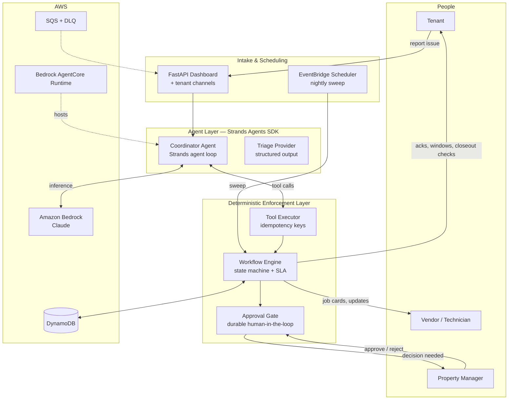

# Handoff

> An autonomous maintenance-coordination agent for property managers — built with the [Strands Agents SDK](https://strandsagents.com) on Amazon Bedrock.

**The problem.** Property managers spend 3+ hours *every day* on vendor coordination — the #1 time drain in the profession (NAA 2025). A single work order takes 8–15 manual touches: triage, vendor calls, quote chasing, scheduling, status checks, invoice matching. 14% of vendor dispatches no-show; 64% of tenants get zero proactive updates while they wait. Maintenance — not rent — is the top driver of negative reviews and non-renewals.

**The agent.** Handoff owns every handoff in that chain. Tenants report an issue; Handoff classifies severity, discovers prices from the vendor bench, dispatches the best-fit vendor with a complete job card, keeps the tenant informed at every step, chases stalled jobs on a schedule, and matches invoices against authorized scope. It runs in the background and **only surfaces for real decisions** — spend above policy threshold, after-hours emergencies, low-confidence triage, invoice discrepancies.

## Status

Work in progress for the [Agents for Humans Hackathon](https://agentsforhumans.devpost.com) (Professional Agents track). Architecture, demo, and build story landing here as the build progresses.

## Quick start

```bash
uv venv --python 3.13 .venv
uv pip install -e ".[dev]"
.venv/bin/python -m pytest tests/          # reliability core
.venv/bin/python -m handoff.demo           # headless demo run
.venv/bin/python -m uvicorn handoff.web.app:app --port 8731   # dashboard
```

Without AWS credentials the app runs on a deterministic heuristic provider (same interfaces, same tests). Set `HANDOFF_MODEL_PROVIDER=bedrock` + standard AWS env vars to run the Strands coordinator agent on Claude via Amazon Bedrock.

## Architecture



### Design principle: probabilistic reasoning, deterministic mechanics

LLM decisions (triage, vendor choice, message drafting) never touch ticket state directly. Every side effect goes through idempotency-keyed tools, so retries after crashes or approval waits can never double-dispatch a vendor or double-send a message. Approval gates persist the exact intended dispatch before pausing, so a PM decision made hours later resumes precisely where the flow stopped.

## License

MIT — see [LICENSE](LICENSE).
