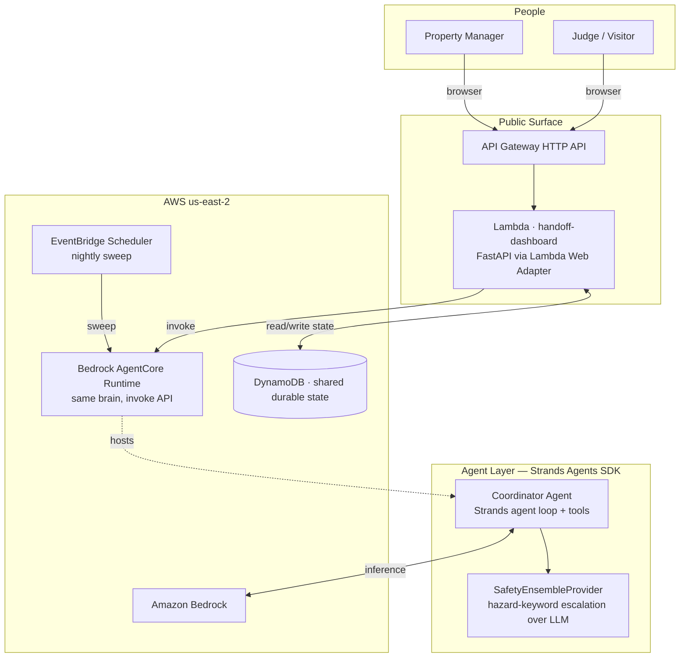

# Handoff

> An autonomous maintenance-coordination agent for property managers — built with the [Strands Agents SDK](https://strandsagents.com) on Amazon Bedrock.

**🔴 Live demo:** https://0fmmk8vbt0.execute-api.us-east-2.amazonaws.com/ — submit a maintenance scenario (try `midnight_flood` with *after hours* checked), watch the agent triage → quote vendors → pause for your approval on big spend, then act as vendor and tenant to complete the cycle. State is durable; come back later and the board remembers.

**The problem.** Property managers spend 3+ hours *every day* on vendor coordination — the #1 time drain in the profession (NAA 2025). A single work order takes 8–15 manual touches: triage, vendor calls, quote chasing, scheduling, status checks, invoice matching. 14% of vendor dispatches no-show; 64% of tenants get zero proactive updates while they wait. Maintenance — not rent — is the top driver of negative reviews and non-renewals.

**The agent.** Handoff owns every handoff in that chain. Tenants report an issue; Handoff classifies severity, discovers prices from the vendor bench, dispatches the best-fit vendor with a complete job card, keeps the tenant informed at every step, chases stalled jobs on a schedule, and matches invoices against authorized scope. It runs in the background and **only surfaces for real decisions** — spend above policy threshold, after-hours emergencies, low-confidence triage, invoice discrepancies.

## Architecture



**Two deployment surfaces share one durable store:** the Lambda-backed dashboard you can open in a browser, and a Bedrock AgentCore Runtime exposing the same agent as an invocation API (`new_request` / `decide` / `sweep` / `status`) for EventBridge-driven background sweeps. Approve a gate from one session; the ticket's dispatched state shows up everywhere else.

### Design principles

1. **Probabilistic reasoning, deterministic mechanics.** LLM decisions never touch ticket state directly. Every side effect goes through idempotency-keyed tools backed by atomic (`update_ticket`) storage — retries after crashes or approval waits can never double-dispatch or double-text.
2. **Durable human gates.** Above-threshold and after-hours dispatches persist the exact intended vendor+price before pausing. The PM's approval — minutes or days later — resumes precisely that action.
3. **Escalation as capability.** Low-confidence triage, universal vendor declines, and invoice discrepancies route to a visible human queue instead of failing silently.
4. **Eval-gated judgment.** Triage accuracy is measured against a 22-case library before anything ships (see [docs/research/aug21-summary.md](docs/research/aug21-summary.md): live-model prompt optimization 64% → **100%, stable**, via an automated propose→eval→keep/discard loop).

## Quick start

```bash
uv venv --python 3.13 .venv
uv pip install -e ".[dev]"
.venv/bin/python -m pytest tests/          # 53 tests: reliability core + redteam pins
.venv/bin/python -m handoff.demo           # headless demo run
.venv/bin/python -m uvicorn handoff.web.app:app --port 8731   # dashboard
```

Without AWS credentials the app runs on deterministic providers (same interfaces, same tests). Set `HANDOFF_MODEL_PROVIDER=bedrock` (+ `AWS_PROFILE`) to run the Strands coordinator on Amazon Bedrock — see `.env.example`.

## License

MIT — see [LICENSE](LICENSE).
